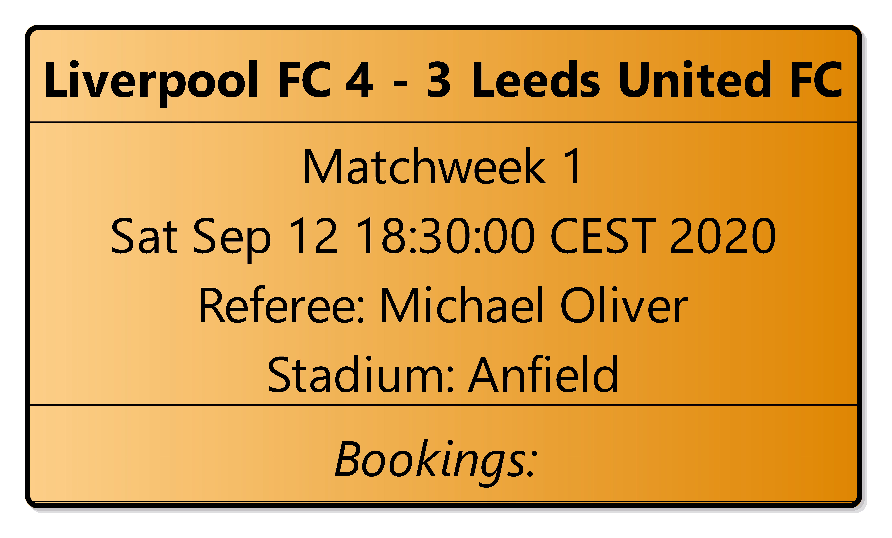
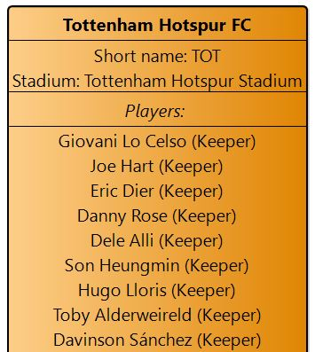
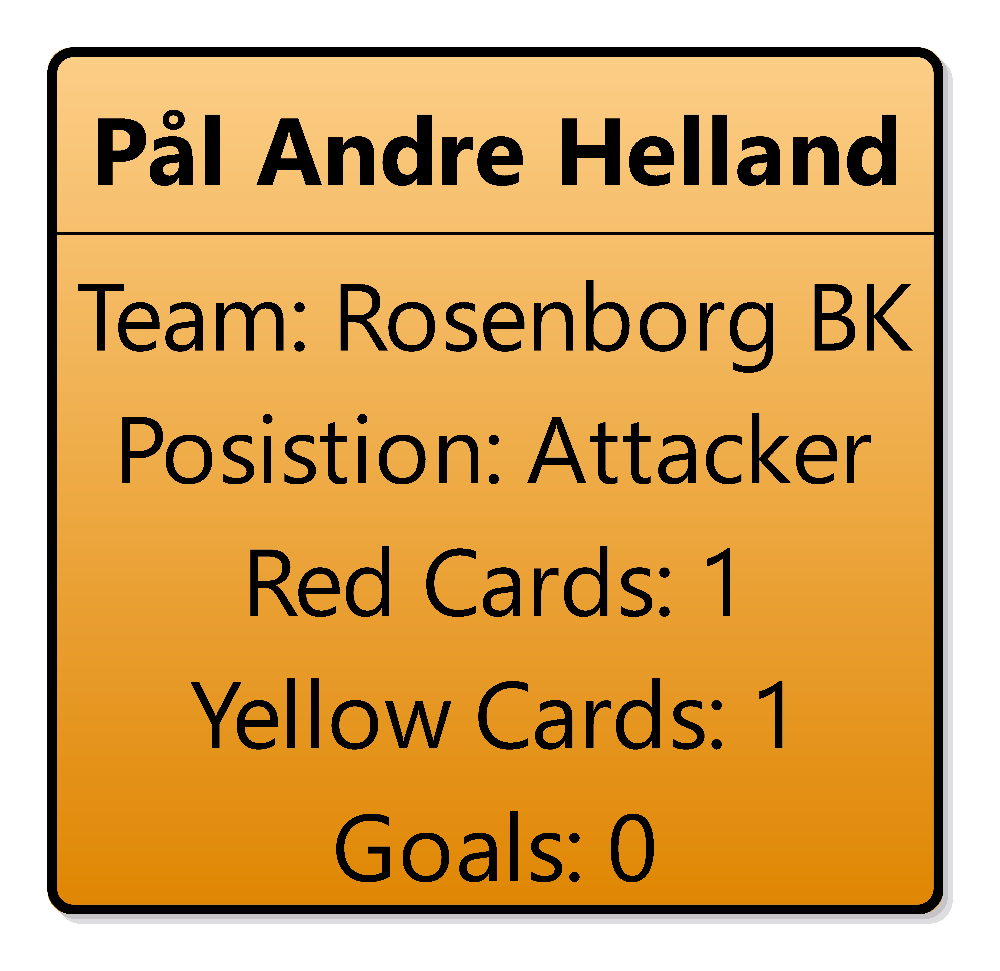
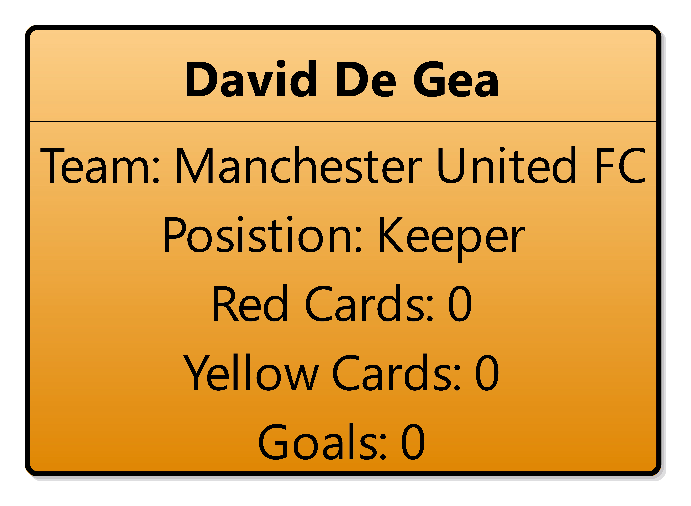
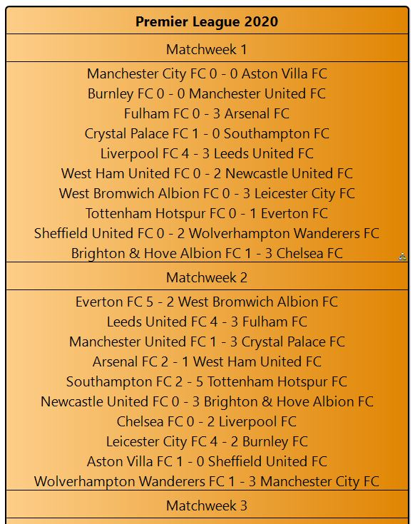
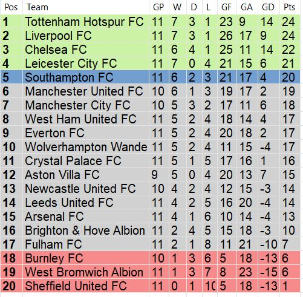
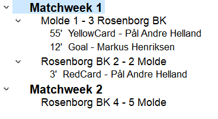
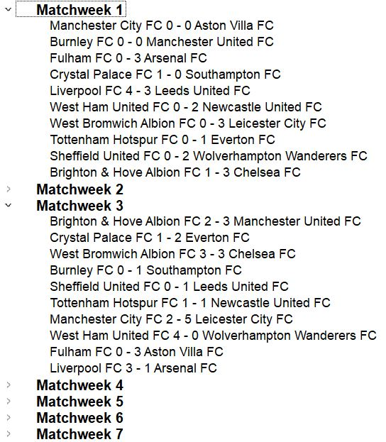

# TDT4250 - Advanced Software Design

Contributors: Vegard Sporstøl, Ralf Leistad, Øystein Bjørkend Haugen and Einar Sønju

<!-- TABLE OF CONTENTS -->
## Table of Contents

* [About the Project](#about-the-project)
    * [Case Description](#case-description)
* [Getting Started](#getting-started)
  * [Clone](#clone)
  * [Prerequisites](#prerequisites)
   * [ApiFetcher](#apifetcher)
* [Model](#model)
* [Viewpoints](#viewpoints)
  * [Diagrams](#diagrams)
  * [Table](#table)
  * [Tree](#tree)
* [Repo Structure](#repo-structure)

<!-- ABOUT THE PROJECT -->
## About The Project

This project is done as a part of the NTNU course TDT4250 - Advanced Software Design

<!-- CASE DESCRIPTION -->
### Case Description

The general task is to build a DSL usable in Eclipse, using relevant frameworks including Xtext and Sirius, but also EMF Forms. 
It may also be relevant to include transformations.

We had some freedom in the details, but we ended up doing a project for creating viewpoints of football matches played in Premier League:

1. We wanted to base the project on the public available data source API from https://www.football-data.org/.
2. The Ecore model should be created in such a way that it is generic, and can be utilized for any kind of football leagues played in a season structure.
3. Sirius will be used for creating different viewpoints, such as mathces, matchweeks, teams, players, seasons, tables and tree structures. 
4. To raise complexity we want to add players and bookings to the model. As well as constraints to ensure that all data in the model is according to relevant rules of the game.

<!-- GETTING STARTED -->
## Getting Started

The following section will cover how to clone and build the project

<!-- CLONE -->
### Clone

The repo must be clone through git using this link: https://github.com/Ebsz/TDT4250-Project.git

### Prerequisites
You need to have the latest versions of Java (8.0.261) and Eclipse (2020-06)

**The following plug-ins must be installed:**

From the standard software site (select Eclipse 2020-06 in drop-down) and with Group Items by Category checked
* Acceleo - model to text transformation (M2T) and OCL interpreter view
* Ecore Diagram Editor (SDK) - editor for ecore models as diagram
* EMF Forms SDK - forms for ecore models
* Sirius Specifier Environment - diagram-based DSL framework
* Sirius Properties Views - Specifier Support
* Mylyn WikiText - editor for various wiki markup formats, including markdown

From the standard software site (select Eclipse 2020-06 in drop-down) and with Group Items by Category un-checked:
* Acceleo Query SDK - OCL implementation

From the software site http://hallvard.github.io/plantuml (type into text field):
* PlantUML Ecore Feature and PlantUML Feature (under PlantUML Eclipse support)
* PlantUML Library Feature (under PlantUML Library)

In addition, install the graphviz command line application and register its path to dot executable in the PlantUML preferences in Eclipse. 
The Eclipse PlantUML plugin is incompatible with the latest graphviz version, so use v2.38.

#### ApiFetcher
To use the ApiFetcher, you will need to import the libraries found under `lib/`. In Eclipse, select all the `*.jar` files and right click -> Build Path -> Add to build path.

<!-- Model -->
## Model
The model illustrates the case description, and is as follows:

<!-- Viewponts -->
## Viewpoints
We have created several viewpoints such as diagrams, a table and a tree structure using Sirius to illustrate the date from the API. These viewpoints are located in the diagram.odesign file in the diagrams-folder. 

To run the transformation and create specific viewpoints for selected parts of the data, the XMI file parsed from the ApiFetcher must be imported in the representations.aird file located in the folder diagrams.examples. From here, double click on the wanted type of viewpoint, and choose the wanted data for creating i.e. a diagram.

The types of viewpoints are listed below:

### Diagrams
* **Match:** Tha match diagram is an illustration of a single match from the data source. And also lists all bookings in that single match. 

* **Matchweek:** Lists all matches in a single matchweek to get an overview of relevant matches the wanted week

* **Team:** Illustrates all data on a selected team, and also lists all players owned by this team. Double clicking on a listed player will automatically direct the user to a player diagram of this player.

* **Player:** Shows all data on a player, and also counts all goals and bookings this player has been involved with during a season.

* **Season:** Shows like the matchweek diagram all relevant matches played, but is for an entire season.

### Table
The table is located at season level, and will illustrate the standings of all teams included in the season selected

### Tree
The tree structure is also at season level, and will illustrate all matches per matchweek during that season

<!-- Repo Structure -->
## Repo Structure
* TDT4250-Project.model
   * /src
      * /impl
      * /util
         * /LeagueValidator.java
* TDT4250-Project.model.tests
   * /src
      * /LeagueValidatorTests.java
   * /League.ecore
   * /League.genmodel
   * /League.xmi
* TDT4250-Project.loader
   * /src/tdt4250/project/loader
      * ResourceLoader.java
      * ModelMapper.java
      * data/
         * ApiFetcher.java
         * CompetitionData.java
         * DataCache.java
         * Parser.java
         * json/
            * CompetitionData.java
            * MatchesData.java
            * MatchData.java
            * MatchWeekData.java
            * PlayerData.java
            * SeasonData.java
            * StandingData.java
            * StandingsData.java
            * TeamData.java
            * TeamsData.java
* TDT4250-Project.diagram
   * /src
      * /Activator.java
      * /Services.java
   * /description
      * /diagram.odesign
* TDT4250-Project.diagram.examples
   * /representations.aird
