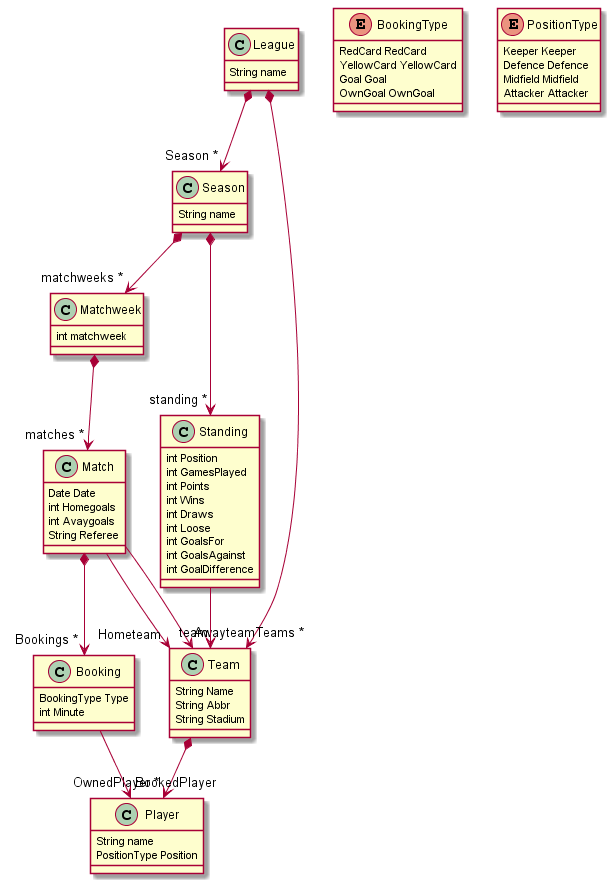

# TDT4250 - Advanced Software Design

Contributors: [Vegard Sporstøl](https://github.com/VegardMS), [Ralf Leistad](https://github.com/ralfleistad), [Øystein Bjørkeng Haugen](https://github.com/oystebha) and [Einar Sønju](https://github.com/ebsz)

<!-- TABLE OF CONTENTS -->
## Table of Contents

* [1 About the Project](#1-about-the-project)
  * [1.1 Case Description](#11-case-description)
* [2. Getting Started](#2-getting-started)
  * [2.1 Prerequisites](#21-prerequisites)
  * [2.2 Project Setup](#22-project-setup)
  * [2.3 Data](#23-data)
* [3. Model](#3-model)
* [4. Viewpoints](#4-viewpoints)
  * [4.1 Diagrams](#41-diagrams)
  * [4.2 Table](#42-table)
  * [4.3 Tree](#43-tree)
* [5. Repo Structure](#5-repo-structure)

<!-- 1 ABOUT THE PROJECT -->
## 1. About The Project

This project was done as a part of the NTNU course TDT4250 - Advanced Software Design during the fall of 2020

<!-- 1.1 CASE DESCRIPTION -->
### 1.1 Case Description

The general task was to build a DSL usable in Eclipse, using relevant frameworks including Xtext and Sirius, but also EMF Forms. 
It may also be relevant to include transformations.

We had some freedom in the details, but ended up doing a project for creating viewpoints of football matches played in Premier League:

1. We want to base the project on the public available data source API from `https://www.football-data.org/`.
2. The Ecore model should be created in such a way that it is generic, and can be utilized for any kind of football leagues played in a season structure.
3. Sirius will be used for creating different viewpoints, such as mathces, matchweeks, teams, players, seasons, tables and tree structures. 
4. To raise complexity we want to add players and bookings and players to the model. As well as constraints to ensure that all data in the model is according to relevant rules of the game.

<!-- 2 GETTING STARTED -->
## 2. Getting Started
The following section covers how to setup the project.

<!-- 2.1 PREREQUISITES -->
### 2.1 Prerequisites
You should have the latest version of Eclipse and at least Java 11 (though it should probably work with previous versions as well) already installed.

#### Plugins
The project requires the following plugins to be present in Eclipse. 

Open the install dialog from the dropdown `Help -> Install new software` and install the following from each site:

From the standard software site (`Eclipse 2020-09` at time of writing):
* With Group Items by Category **checked**:
  * Acceleo - model to text transformation (M2T) and OCL interpreter view
  * Ecore Diagram Editor (SDK) - editor for ecore models as diagram
  * EMF Forms SDK - forms for ecore models
  * Sirius Specifier Environment - diagram-based DSL framework
  * Sirius Properties Views - Specifier Support
  * Mylyn WikiText - editor for various wiki markup formats, including markdown
* With Group Items by Category **un-checked**:
  * Acceleo Query SDK - OCL implementation
  
From `http://ghillairet.github.io/p2`:
* EMF Json (Jackson)

<!-- 2.1 CLONE -->
### 2.2 Project setup
1. Clone the project with `git clone`
2. Import all five root-level projects -`diagram`, `diagram.examples`, `loader`, `model`, and `model.tests` -  into eclipse with
  `File -> Import.. -> Existings Projects into Workspace`. Select the directory you previously cloned to repository to as root directory, make sure all 5 projects are checked, then click finish.
<!-- 2.3 Data -->
### 2.3 Data
A generated Premier League model can be found at `diagram.examples/output/premier_league.xmi`, as well as a handwritten example model at `model/League.xmi`

To get the most recent data from the api, run `/loader/ResourceLoader.java`. This will fetch data about a league from the [API](https://www.football-data.org/) and generates the corresponding model. By default the file is saved to `/diagram.examples/output/league.xmi.` It defaults to the latest season of Premier League, but supports fetching data about any competition available in the API by changing `COMPETITION_ID` in the main `ResourceLoader` class.

Note: due to an unresolved bug, all players' positions are incorrectly set to be Keepers.  

<!-- 3. MODEL -->
## 3. Model
The model is created using Ecore and is supposed to cover the entire case description, and is illustrated as follows using PlantUML:

<!-- 4. VIEWPOINTS -->
## 4. Viewpoints
We have created several viewpoints such as diagrams, a table and a tree structure using Sirius to illustrate the date from the API. These viewpoints are located in the `diagram.odesign` file in the diagrams-package. 

To run the transformation and create specific viewpoints for selected parts of the data, the XMI-file parsed from the ApiFetcher must be imported in the `representations.aird` file located in the package `diagrams.examples`. From here, double click on the wanted type of viewpoint, and choose the wanted data for creating i.e. a diagram.

The types of viewpoints and their features are listed below:

<!-- 4.1 DIAGRAMS -->
### 4.1 Diagrams
* **Match:** Tha match diagram is an illustration of a single match from the data source. And also lists all bookings in that single match. Due to the api taking extra charges to access the bookings, these are not included when creating viewpoints from the real data source. To illustrate that this feature actually works, an image and a manually created instance from Eliteserien is also accessible in the project.

* **Matchweek:** Lists all matches in a single matchweek to get an overview of relevant matches the wanted week

* **Team:** Illustrates all data on a selected team, and also lists all players owned by this team. Double clicking on a listed player will automatically direct the user to a player diagram of this player.

* **Player:** Shows all data on a player, and also counts all goals and bookings this player has been involved with during a season. In this case, an example of the manually instance from Eliteserien is included, due to the same issue with bookings not being free in the api.

* **Season:** Shows like the matchweek diagram all relevant matches played, but is for an entire season.

<!-- 4.2 TABLE -->
### 4.2 Table
The table is located at season level, and will illustrate the standings of all teams included in the season selected

<!-- 4.3 TREE -->
### 4.3 Tree
The tree structure is also at season level, and will illustrate all matches per matchweek during that season. An example of how bookings is supposed to be illustrated is also added here.

<!-- 5. REPO STRUCTURE -->
## 5. Repo Structure
* TDT4250-Project.model
   * /src
      * /impl
      * /util
         * /LeagueValidator.java
* TDT4250-Project.model.tests
   * /src
      * /LeagueValidatorTests.java
   * /League.ecore
   * /League.genmodel
   * /League.xmi
* TDT4250-Project.loader
   * /src/tdt4250/project/loader
      * ResourceLoader.java
      * ModelMapper.java
      * data/
         * ApiFetcher.java
         * CompetitionData.java
         * DataCache.java
         * Parser.java
         * json/
            * CompetitionJson.java
            * MatchesJson.java
            * MatchJson.java
            * MatchWeekJson.java
            * PlayerJson.java
            * SeasonJson.java
            * StandingJson.java
            * StandingsJson.java
            * TeamJson.java
            * TeamsJson.java
* TDT4250-Project.diagram
   * /src
      * /Activator.java
      * /Services.java
   * /description
      * /diagram.odesign
* TDT4250-Project.diagram.examples
   * /representations.aird
   * /output
      * /league.xmi
* TDT4250-Project.pictures
